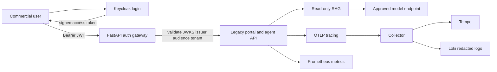

# Pilot identity and telemetry architecture

```mermaid
flowchart LR
 U[Commercial user] --> KC[Keycloak login]
 KC -->|signed access token| U
 U -->|Bearer JWT| GW[FastAPI auth gateway]
 GW -->|validate JWKS issuer audience tenant| B[Legacy portal and agent API]
 B --> A[Read-only RAG]
 A --> M[Approved model endpoint]
 B --> OT[OTLP tracing] --> C[Collector] --> T[Tempo]
 B --> PM[Prometheus metrics]
 C --> L[Loki redacted logs]
```
Cross-tenant legacy reads are explicitly NOT secured in current pilot; never add real confidential tenants.
