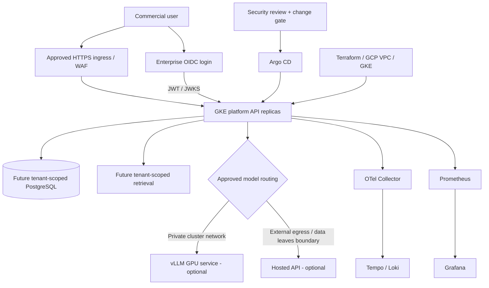
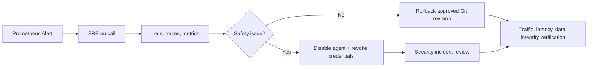

# Deployment, data residency and operations

```mermaid
flowchart TB
 User[Commercial user] --> IDP[Enterprise OIDC login]
 User --> WAF[Approved HTTPS ingress / WAF]
 WAF --> GKE[GKE platform API replicas]
 IDP -->|JWT / JWKS| GKE
 GKE --> PG[(Future tenant-scoped PostgreSQL)]
 GKE --> RAG[Future tenant-scoped retrieval]
 GKE --> AI{Approved model routing}
 AI -->|Private cluster network| V[vLLM GPU service - optional]
 AI -->|External egress / data leaves boundary| H[Hosted API - optional]
 GKE --> OC[OTel Collector] --> TE[Tempo / Loki]
 GKE --> PR[Prometheus] --> GR[Grafana]
 AR[Argo CD] --> GKE
 TF[Terraform / GCP VPC / GKE] --> GKE
 SEC[Security review + change gate] --> AR
```

```mermaid
flowchart LR
 Alert[Prometheus Alert] --> OnCall[SRE on call]
 OnCall --> Diagnose[Logs, traces, metrics]
 Diagnose --> Decision{Safety issue?}
 Decision -->|Yes| Disable[Disable agent + revoke credentials]
 Decision -->|No| Rollback[Rollback approved Git revision]
 Disable --> Incident[Security incident review]
 Rollback --> Verify[Traffic, latency, data integrity verification]
 Incident --> Verify
```
Dashed/future components are design-only: diagram is target architecture, not installed state.
